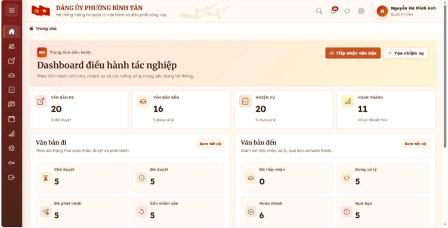
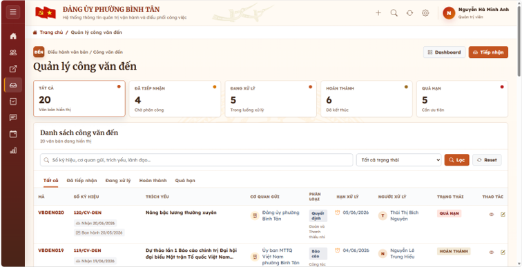
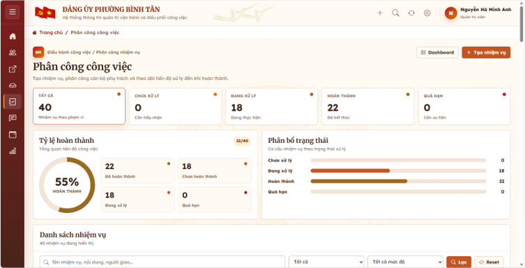
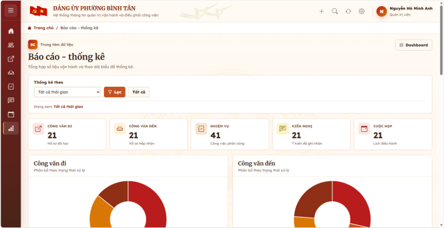

# Hệ thống thông tin quản trị vận hành và điều phối công việc

## 1. Giới thiệu dự án

Đây là hệ thống web được xây dựng nhằm hỗ trợ quản lý công văn đi, công văn đến, phân công nhiệm vụ, theo dõi tiến độ công việc, quản lý ý kiến kiến nghị, hội nghị cuộc họp và báo cáo thống kê tại đơn vị hành chính.

Dự án được thực hiện trong quá trình Thực hành nghề nghiệp ngành Hệ thống Thông tin Quản lý.

## 2. Vai trò thực hiện

- Khảo sát hiện trạng nghiệp vụ tại đơn vị thực tập
- Phân tích yêu cầu chức năng và phi chức năng
- Thiết kế mô hình hệ thống: BFD, DFD, ERD, Use Case, UML
- Thiết kế cơ sở dữ liệu trên Microsoft SQL Server
- Xây dựng giao diện và chức năng hệ thống web
- Kiểm thử chức năng theo từng vai trò người dùng
- Hoàn thiện báo cáo phân tích thiết kế hệ thống

## 3. Công nghệ sử dụng

- Python Flask
- Microsoft SQL Server
- HTML/CSS
- JavaScript
- Bootstrap
- Draw.io
- PowerDesigner
- Figma
- Visual Studio Code

## 4. Chức năng chính

- Đăng nhập, đăng xuất
- Đổi mật khẩu, quên mật khẩu
- Quản lý tài khoản người dùng
- Phân quyền người dùng theo vai trò
- Quản lý công văn đi
- Quản lý công văn đến
- Phân công nhiệm vụ
- Cập nhật tiến độ công việc
- Quản lý ý kiến, kiến nghị
- Quản lý hội nghị, cuộc họp
- Báo cáo thống kê
- Sao lưu và khôi phục dữ liệu

## 5. Một số giao diện hệ thống

### Màn hình đăng nhập

### Màn hình chính

### Quản lý công văn đến

### Phân công nhiệm vụ

### Báo cáo thống kê

## Database

File database mẫu nằm tại:

[database/database_sample.sql](database/database_sample.sql)

Dữ liệu trong file đã được làm sạch, chỉ dùng cho mục đích demo và học tập.
